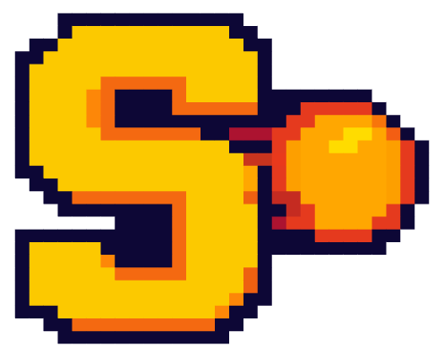
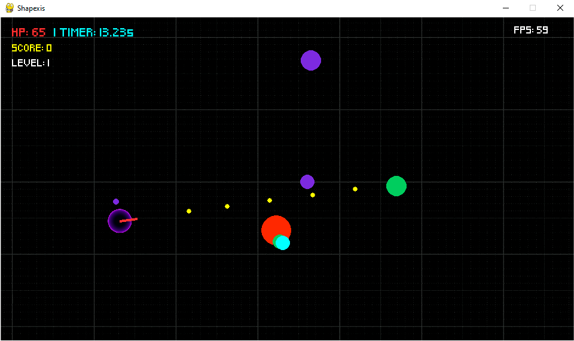

<p>
  
  <span style="font-size:1.8em;"><strong>Shapexis 🟣💥</strong></span>
</p>

A modern 2D arcade-style shooter game built with Python and Pygame, featuring modular object-oriented design, SQLite database integration, and multiple player skins with unlockable content.

<br>


<h3 align="center">Status: 🚀 Finished</h3>

<p  align="center">
  
  
</p>

## Table of Contents

- [Features](#features-)
- [Screenshots](#-screenshots)
- [Requirements](#-requirements)
- [Installation](#-installation)
- [How to Play](#%EF%B8%8F-how-to-play)
- [Project Structure](#%EF%B8%8F-project-structure)
- [Contributing](#-contributing)
- [Compilation](#-compilation)

## Features 🏆🎨

- Multi-level progression with increasing difficulty
- Score system with persistent high scores
- Custom player skins with unlockable content
- Skin unlocking based on score achievements
- Top 10 leaderboard with persistent storage

### 🛠️ Technical Features
- **Modular OOP architecture** with clean separation of concerns
- **Design Patterns**: Factory Pattern for level creation and Proxy Pattern for database operations
- **SQLite database** integration for score persistence
- **Pygame framework** for cross-platform compatibility

## 📸 Screenshots





## 📝 Requirements

- Python 3.7 or higher
- Pygame 2.6.1
- SQLite3 (included with Python)

## 🔧 Installation

### 1. Clone the Repository

```bash
git clone https://github.com/yourusername/shapexis.git
cd shapexis
```

### 2. Install Dependencies

```bash
pip install -r requirements.txt
```

### 3. Run the Game

```bash
python main.py
```

## 🕹️ How to Play

### 🎮 Controls
- **W, A, S, D** - Move player
- **Mouse** - Aim weapon
- **Left Click** - Shoot
- **ESC** - Return to menu/pause
- **Enter/Space** - Confirm selections
- **Arrow Keys** - Navigate menus

### 👾 Gameplay
1. **Start** from the main menu
2. **Select** your preferred skin (some require high scores to unlock)
3. **Survive** waves of enemies for the duration of each level
4. **Earn points** by defeating enemies
5. **Progress** through multiple levels with increasing difficulty
6. **Compete** for high scores on the leaderboard

### 👕🔒 Skin Unlocks
Skins are unlocked by achieving specific scores:
- **Black Hole**: 340+ points
- **Watermelon**: 555+ points  
- **Orange**: 1135+ points
- **Sun**: 1810+ points
- **Planet 1**: 2200+ points
- **Planet 2**: 2500+ points
- **Planet 3**: 3000+ points

## 🗂️ Project Structure

```
shapexis/
├── assets/                 # Game assets
│   ├── audio/             # Sound effects and music
│   ├── fonts/             # Custom fonts
│   ├── skins/             # Player character skins
│   └── *.png              # Background images
├── code/                  # Source code (modular OOP design)
│   ├── Const.py           # Game constants and configuration
│   ├── Entity.py          # Base entity class
│   ├── Player.py          # Player character logic
│   ├── Enemy.py           # Enemy and behavior
│   ├── Level.py           # Level management and gameplay
│   ├── Game.py            # Main game state machine
│   ├── Menu.py            # Main menu system
│   ├── Score.py           # High score and leaderboard
│   ├── SkinSelector.py    # Character skin selection
│   ├── DBProxy.py         # SQLite database interface
│   └── ...                # Additional game components
├── main.py                # Application entry point
├── requirements.txt       # Python dependencies
└── README.md             
```

## 🤝 Contributing

### 🚀 Getting Started

1. **Fork** the repository
2. **Create** a feature branch: `git checkout -b feature/amazing-feature`
3. **Make** your changes following the existing code style
4. **Test** your changes thoroughly
5. **Commit** your changes: `git commit -m 'Add amazing feature'`
6. **Push** to the branch: `git push origin feature/amazing-feature`
7. **Open** a Pull Request

### 🐛 Reporting Issues

If you find a bug or have a suggestion:

1. Check if the issue already exists
2. Create a new issue with:
   - Clear description of the problem
   - Steps to reproduce
   - Expected vs actual behavior
   - System information (OS, Python version)

## 💾 Compilation

To create a standalone executable using PyInstaller:

### Prerequisites
```bash
pip install pyinstaller
```

### Step 1: Modify main.py
Add the following code **at the very beginning** of your `main.py` file, before any other imports:

```python
import sys, os

if getattr(sys, 'frozen', False):
    # If the application is run as a bundle, the PyInstaller bootloader
    # extends the sys module by a flag frozen=True and sets the app
    # path into variable _MEIPASS'.
    application_path = sys._MEIPASS
else:
    application_path = os.path.dirname(os.path.abspath(__file__))

# -----------
```

### Step 2: Compile the Executable
Run the following command in your project directory:

```bash
pyinstaller -F --noconsole main.py
```

### Step 3: Package the Game
1. Navigate to the `dist` folder created by PyInstaller
2. Copy the `assets` folder into the `dist` directory
3. The executable is now complete and ready to distribute

### Final Structure
```
dist/
├── main.exe          # Your compiled executable
└── assets/           # Game assets folder
    ├── audio/
    ├── fonts/
    ├── skins/
    └── *.png
```

The game will run independently on any Windows machine without requiring Python installation.


**Enjoy playing Shapexis!** 🎮✨

---
<h3 align="center">This project was made with ❤️ by Pedro Silva</h3>
